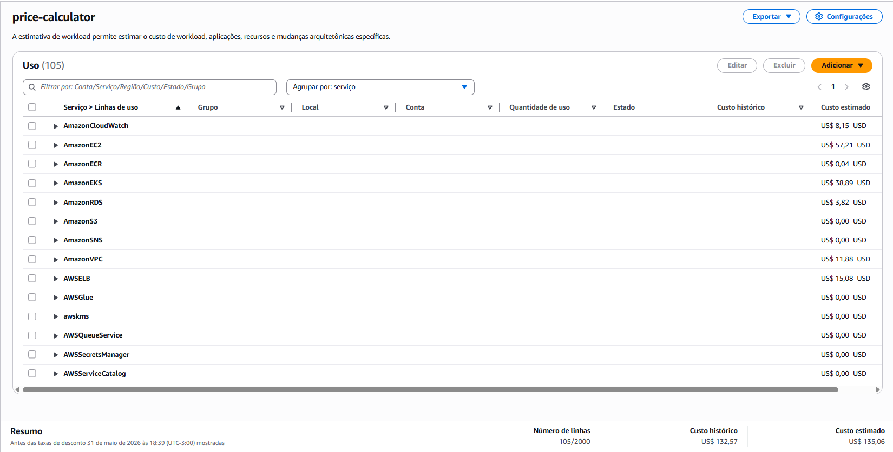

# PaaS e Custos

## Plano de Custos

A estimativa foi gerada pela calculadora de preços da AWS com base nos serviços utilizados no projeto. O custo total estimado é de **US$ 135,06/mês**.

| Serviço | Custo estimado (USD/mês) | Finalidade no projeto |
|---|---|---|
| AmazonEC2 | US$ 57,21 | Nós de trabalho (worker nodes) do cluster EKS |
| AmazonEKS | US$ 38,89 | Plano de controle gerenciado do Kubernetes |
| AWSELB | US$ 15,08 | Load balancer externo para expor o gateway |
| AmazonVPC | US$ 11,88 | Rede privada virtual, sub-redes e NAT Gateway |
| AmazonCloudWatch | US$ 8,15 | Logs e métricas dos serviços na AWS |
| AmazonRDS | US$ 3,82 | Banco de dados PostgreSQL gerenciado |
| AmazonECR | US$ 0,04 | Registro de imagens Docker dos microsserviços |
| AmazonS3 | US$ 0,00 | Armazenamento de objetos (dentro do free tier) |
| AmazonSNS | US$ 0,00 | Notificações (dentro do free tier) |
| AWSQueueService | US$ 0,00 | Filas (dentro do free tier) |
| AWSSecretsManager | US$ 0,00 | Armazenamento de credenciais sensíveis |
| AWSGlue | US$ 0,00 | Catálogo de dados (dentro do free tier) |
| awskms | US$ 0,00 | Gerenciamento de chaves de criptografia |
| AWSServiceCatalog | US$ 0,00 | Catálogo de serviços (dentro do free tier) |
| **Total** | **US$ 135,06** | |

> Valores antes de descontos, referentes a 31 de maio de 2026.

---

## Uso de PaaS

PaaS (*Platform as a Service*) são serviços gerenciados que abstraem a infraestrutura subjacente — o provedor cuida de instalação, atualização, disponibilidade e escalabilidade, e o time foca apenas na aplicação.

No projeto, utilizamos PaaS em três pontos:

### Amazon EKS — Orquestração de Containers

O **Amazon EKS** gerencia o plano de controle do Kubernetes (API server, etcd, scheduler). Sem ele, seria necessário provisionar, configurar e manter manualmente as VMs que compõem o control plane.

Todos os microsserviços (gateway, account, auth, product, order, kafka, prometheus, grafana) são deployados como pods no cluster EKS via manifests YAML. O HPA (Horizontal Pod Autoscaler) também é gerenciado pelo EKS, permitindo escalar o gateway automaticamente com base em CPU.

### Amazon RDS — Banco de Dados PostgreSQL Gerenciado

O **Amazon RDS** fornece o PostgreSQL como serviço gerenciado. Os serviços de account, product e order apontam para o endpoint do RDS via variáveis de ambiente injetadas por Secrets e ConfigMaps do Kubernetes (`db-credentials`, `postgres-configmap`).

O benefício é não precisar gerenciar backup, patching, replicação ou failover do banco — isso fica a cargo da AWS.

### Amazon ECR — Registro de Imagens Gerenciado

O **Amazon ECR** armazena as imagens Docker geradas pelo pipeline CI/CD (Jenkins). Os manifests de deployment referenciam as imagens diretamente pelo URI do ECR (ex: `730335608828.dkr.ecr.us-east-2.amazonaws.com/product:latest`), e o EKS faz o pull automaticamente com as permissões IAM do cluster.

---

### O que **não** é PaaS neste projeto

Kafka e Redis rodam como pods dentro do próprio cluster EKS (não como serviços gerenciados como MSK ou ElastiCache). Isso significa que o time é responsável pela configuração, disponibilidade e escalabilidade desses serviços.
